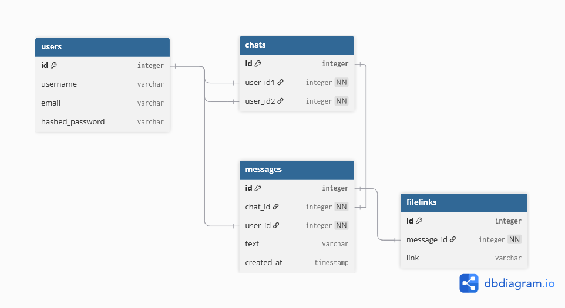

# WebMessenger
Web Messenger implementation. Uses React for front-end and Python(FastAPI) for back-end.

# Functionality

This messenger allows the user to:

1. Login and Register by typing username , email and password.
2. See their all existing chats, and by clicking on them: existing messages.
3. Create one-on-one chat by typing the target's username.
4. Send messages to other users.

Authentication is enabled by OAuth2 and JWT tokens. All passwords are hashed. Text in messages is currently not encrypted.

# Build and Run(Docker)

To run this in docker , you need to create .env with POSTGRES variables. Example :

```bash
POSTGRES_USER= postgres
POSTGRES_PASSWORD= 1234
POSTGRES_DB= MessengerDB
```

Then you can build this application using docker by using :

```bash
docker-compose up --build
```
# Build and Run
Otherwise, you need to run frontend and backend separately:

Inside backend folder, you want to create similar .env file:

```bash
DB_USER=postgres
DB_PASSWORD=1234
DB_HOST=localhost
DB_PORT=5432
DB_NAME=MessengerDB
DB_TEST_NAME=TestMessengerDB
```

Where `DB_TEST_NAME` is database that is used for testing with the help of pytest.

You need to have these databases created before running backend.

Then install python libraries by running:

`pip install --no-cache-dir -r requirements.txt`

Then you can ran the api by using uvicorn:

`uvicorn app.main:app`

You can run tests using this command:

`pytest`

For frontend, you to install packages, you need to run this command:

`npm install`

Then you can run frontend by using:

`npm run dev`

# Database schema



1. User is self-explanatory. In the future, I plan do add profile_picture_id.
2. One-on-one chats require 2 user_ids. With implementation of group chats, junction table should be used instead.
3. Messages is also self-explanatory. user_id is the user that sent the message.
4. Filelink are files attached to messages, consists of message_id and link to the file(functionality not yet implemented).


